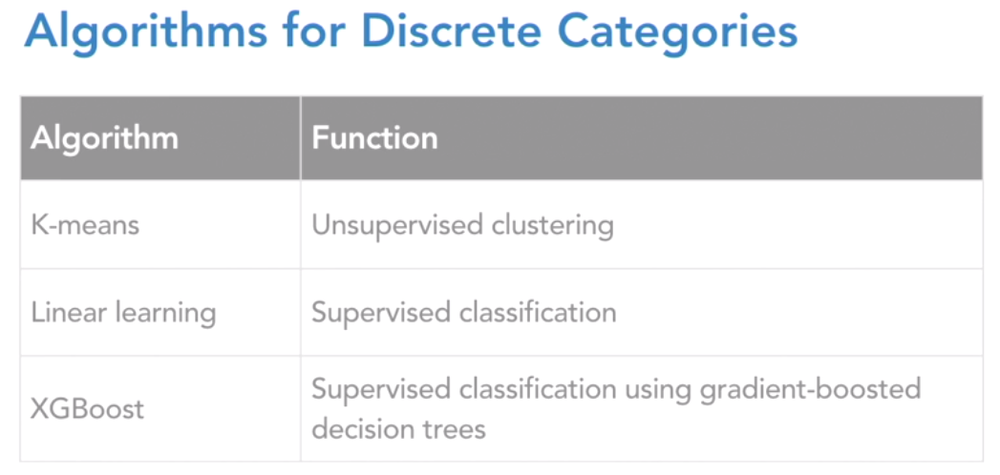

# Amazon Web Services Machine Learning Essential Training
1. Introduction
	1. Welcome
	1. About using cloud services
1. Machine Learning on AWS
	1. AWS Machine Leanring Concepts
		
		
	1. Business scenarios for machine learning
		
		
		
	1. Which algorithm should I use?
		
		
	1. AWS AI servers vs platforms
		
	1. AWS AI platforms vs frameworks
		
	1. A classifier in action: Amazon Macie
1. Machine Learning API services
	1. Setup for AWS machine learning APIs
		
		
	1. Predict using AWS Comprehend for NLP
		
	1. Predict using AWS Polly test-to-speech
		
	1. Predict using AWS Lex for chatbots
		
	1. Predict using AWS Rekognition for images
		
	1. Predict using AWS Rekognition for videos
		
	1. Predict using Translate and Transcribe
		
1. Machine learning Platforms
	1. Understanding ML Platforms
		
	1. Understanding and using AWS ML
	1. Understanding SageMaker
		
		
		
	1. Create jupyter notebook with sagemaker
		
	1. Get data with SageMaker notebook
	1. Train model with sagemaker job
	1. Deploy and host model with sagemaker model
	1. Use model from sagemaker endpoint
	1. Selecting algotrithm for model training
		
		
		
		
		
		
	1. Advanced use of sagemaker
1. Machine learning Virtual servers
1. Conclusion ...